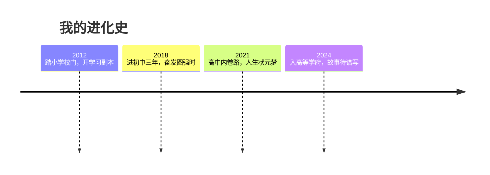

# 你好，我是 ZQ Jacky —— 一个 "Hello World" 写了 100 次还在写的学生
> ✨ **目标：** 用代码把作业变成艺术品（偶尔也把艺术变成 bug）  


---

## 🌱 当前状态 —— 一名萌新的进化史  
```python
while True:
    写代码()
    遇bug = True
    if 遇bug:
        查文档() + 喝奶茶()
    else:
        惊喜("居然能跑？！")
```


```mermaid
timeline
    title 我的进化史
    2012  踏小学校门，开学习副本
    2018  进初中三年，奋发图强时
    2021  高中内卷路，人生状元梦
    2024  入高等学府，故事待谱写
```
#### 📫 **召唤方式**  More actions
- 🐙 **GitHub**: [@ZQ JACKY](https://github.com/BAYUEQI) (我的代码魔法阵)。  
- 🐦 **Telegram**: [@ZQ JACKY](https://t.me/bayueqi) (偶尔看看外面世界)。  
- ✉️ **邮箱**: [@ZQ JACKY](mailto:byqijk@gmail.com) (魔法咒语请用加密信封)。  
